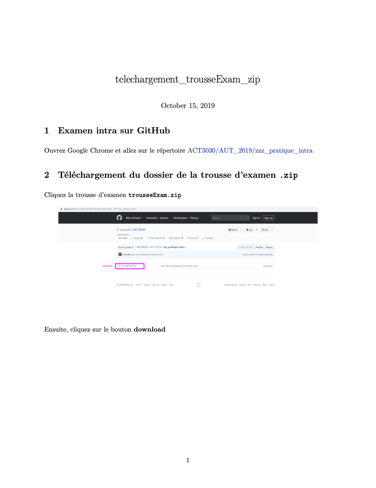

# ACT3035, Examen final de l'automne 2019

    <object data="telechargement_trousseExam_zip.pdf" type="application/pdf" width="700px" height="1200px">
        <embed src="telechargement_trousseExam_zip.pdf">
            
        </embed>
    </object>

* Vous pouvez télécharger la trousse d'examen (`trousseExam.zip`) et la décompresser comme nous l'avons fait en classe. Sinon, vous pouvez vous référer au pdf `telechargement_trousseExam_zip.pdf` ci-haut.
* À 9:00, le questionnaire de l'examen sera disponible ci-haut sous le nom (`1_Questions_A19_final.pdf`). Vous pouvez le consulter directement en cliquant dessus ou le télécharger avec le bouton Download.
* Inscrivez toutes vos réponses dans le gabarit de réponse `BRUH123456.sas` se trouvant dans la trousse `trousseExam.zip`. N'oubliez pas de le renommer avec votre code permanent.
* Lorsque vous terminez l'examen, vous pouvez le déposer en suivant [ce lien](https://www.dropbox.com/request/uoriaHyFRkNUxEfqXCrj).
